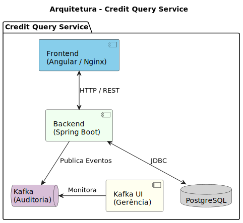

# Credit Query Service

Sistema de consulta de créditos de ISSQN (Imposto Sobre Serviços de Qualquer Natureza) através do número da NFS-e ou número do crédito.

## 📋 Índice

- [Visão Geral](#visão-geral)
- [Arquitetura](#arquitetura)
- [Tecnologias](#tecnologias)
- [Estrutura do Projeto](#estrutura-do-projeto)
- [Pré-requisitos](#pré-requisitos)
- [Configuração e Execução](#configuração-e-execução)
  - [🛥️ Executando com Docker (Recomendado)](#-executando-com-docker-recomendado)
  - [💻 Executando Localmente](#-executando-localmente)
- [API Endpoints](#api-endpoints)
- [Testes](#testes)
- [Banco de Dados](#banco-de-dados)
- [Auditoria](#auditoria)

## 📖 Visão Geral

Este sistema permite a consulta de créditos de ISSQN de forma eficiente. Ele fornece uma API REST para busca de créditos e uma interface web Angular para interação com os usuários.

**Funcionalidades principais:**
- Consulta de créditos por número NFS-e
- Consulta de créditos por número do crédito
- Auditoria de todas as operações via Kafka
- Interface web responsiva para consultas

## 🏗 Arquitetura



## 🛠 Tecnologias

### Backend
- **Spring Boot 3.5.9** - Framework principal
- **Java 17** - Linguagem de programação
- **Spring Data JPA** - Persistência de dados
- **Spring Kafka** - Sistema de mensageria
- **Flyway** - Migrações de banco de dados
- **Lombok** - Redução de boilerplate
- **PostgreSQL** - Banco de dados relacional

### Frontend
- **Angular 21** - Framework frontend
- **TypeScript** - Linguagem de programação
- **SCSS** - Pré-processador CSS
- **RxJS** - Programação reativa
- **Nginx** - Servidor web e proxy reverso

### Infraestrutura
- **Docker** - Containerização
- **Docker Compose** - Orquestração de containers
- **Testcontainers** - Containers para testes
- **Kafka UI** - Interface web para gerenciamento do Kafka

## 📁 Estrutura do Projeto

```
credit-query-service/
├── backend/                    # Aplicação Spring Boot
│   ├── Dockerfile              # Dockerfile do backend
│   ├── src/main/java/com/credit_query/backend/
│   │   ├── controller/         # Controllers REST
│   │   ├── service/            # Serviços de negócio
│   │   ├── entity/             # Entidades JPA
│   │   ├── dto/                # Data Transfer Objects
│   │   ├── repository/         # Repositórios de dados
│   │   ├── exception/          # Tratamento de exceções
│   │   ├── producer/           # Produtores Kafka
│   │   ├── BackendApplication.java
│   │   └── ServletInitializer.java
│   ├── src/main/resources/
│   │   ├── application.properties
│   │   └── db/migration/       # Migrations Flyway
│   └── src/test/               # Testes
├── frontend/                   # Aplicação Angular
│   ├── Dockerfile              # Dockerfile do frontend
│   ├── nginx.conf              # Configuração do Nginx
│   ├── src/app/
│   │   ├── core/               # Serviços e modelos core
│   │   ├── features/           # Funcionalidades
│   │   │   ├── components/     # Componentes reutilizáveis
│   │   │   └── creditos/       # Módulo de créditos
│   │   ├── app.ts
│   │   └── app.routes.ts
│   └── angular.json
├── docker/
│   ├── docker-compose.yml      # Infraestrutura básica
│   └── docker-compose.full.yml # Todos os serviços
├── Makefile                    # Comandos úteis
└── README.md
```

## 📦 Pré-requisitos

### Para Docker (Recomendado)
- **Docker** 20.10+
- **Docker Compose** 2.0+

### Para Execução Local
- **Java 17** ou superior
- **Maven 3.8+**
- **Node.js 18+**
- **Angular CLI 18+**
- **PostgreSQL 15+**
- **Apache Kafka**

## ⚙️ Configuração e Execução

### 🛥️ Executando com Docker (Recomendado)

A forma mais simples de executar o sistema completo é usando Docker:

#### Usando Make (Linux/macOS)

```bash
# Iniciar todos os serviços
make up

# Ver logs de todos os serviços
make logs

# Parar todos os serviços
make down

# Reiniciar serviços
make restart

# Limpar tudo (containers, volumes)
make clean
```

#### Usando Docker Compose diretamente

```bash
# Iniciar todos os serviços
docker-compose -f docker/docker-compose.full.yml up -d

# Ver logs
docker-compose -f docker/docker-compose.full.yml logs -f

# Parar serviços
docker-compose -f docker/docker-compose.full.yml down
```

#### Portas expostas

| Serviço | Porta | Descrição |
|---------|-------|-----------|
| Frontend | 80 | Interface web (acesso via http://localhost) |
| Backend | 8080 | API REST |
| PostgreSQL | 5432 | Banco de dados |
| Kafka | 9092 | Mensageria |
| Kafka UI | 8081 | Interface web para Kafka |

#### URLs de Acesso

- **Aplicação Web**: http://localhost
- **API Backend**: http://localhost/api/creditos
- **Kafka UI**: http://localhost:8081

### 💻 Executando Localmente

#### 1. Subir a infraestrutura (Banco e Kafka)

```bash
cd docker
docker-compose up -d
```

Isso iniciará:
- PostgreSQL na porta 5432
- Kafka na porta 9092

#### 2. Executar o Backend

```bash
cd backend
./mvnw spring-boot:run
```

O backend estará disponível em: `http://localhost:8080`

#### 3. Executar o Frontend

```bash
cd frontend
npm install
ng serve
```

A aplicação frontend estará disponível em: `http://localhost:4200`

## 🔗 API Endpoints

### Base URL (Docker)
```
http://localhost/api/creditos
```

### Base URL (Local)
```
http://localhost:8080/api/creditos
```

### Endpoints disponíveis

| Método | Endpoint | Descrição |
|--------|----------|-----------|
| GET | `/{numeroNfse}` | Busca créditos por número da NFS-e |
| GET | `/credito/{numeroCredito}` | Busca crédito específico por número |

### Exemplos de Requisição

**Buscar por NFS-e:**
```bash
# Docker
curl http://localhost/api/creditos/12345

# Local
curl http://localhost:8080/api/creditos/12345
```

**Buscar por número do crédito:**
```bash
# Docker
curl http://localhost/api/creditos/credito/123456

# Local
curl http://localhost:8080/api/creditos/credito/123456
```

### Response (Sucesso - 200 OK)
```json
{
  "numeroCredito": "123456",
  "numeroNfse": "12345",
  "dataConstituicao": "2024-01-15",
  "valorIssqn": 1500.00,
  "tipoCredito": "ISSQN",
  "simplesNacional": "Sim",
  "aliquota": 5.00,
  "valorFaturado": 30000.00,
  "valorDeducao": 0.00,
  "baseCalculo": 30000.00
}
```

### Response (Não Encontrado - 404)
```json
{
  "title": "Recurso não encontrado",
  "status": 404,
  "detail": "Crédito 1111 não encontrado."
}
```

## 🧪 Testes

### Executar testes do Backend

```bash
cd backend
./mvnw test
```

Os testes de integração utilizam **Testcontainers** para criar instâncias efêmeras de PostgreSQL e Kafka durante a execução.

### Cobertura de Testes
- **Testes Unitários**: Service tests com mock de dependências
- **Testes de Integração**: Controller tests com Testcontainers
- **Testes de API**: Verificação de endpoints REST

## 🗄 Banco de Dados

### Tabela Principal: `credito`

| Coluna | Tipo | Descrição |
|--------|------|-----------|
| id | BIGINT | Chave primária auto-incrementada |
| numero_credito | VARCHAR(50) | Número único do crédito |
| numero_nfse | VARCHAR(50) | Número da NFS-e relacionada |
| data_constituicao | DATE | Data de constituição do crédito |
| valor_issqn | DECIMAL(15,2) | Valor do ISSQN |
| tipo_credito | VARCHAR(50) | Tipo do crédito |
| simples_nacional | BOOLEAN | Indicador Simples Nacional |
| aliquota | DECIMAL(5,2) | Alíquota aplicada |
| valor_faturado | DECIMAL(15,2) | Valor total faturado |
| valor_deducao | DECIMAL(15,2) | Valor das deduções |
| base_calculo | DECIMAL(15,2) | Base de cálculo do imposto |

### Migrações Flyway
- `V1__create_table_credito.sql` - Cria a estrutura da tabela
- `V2__populate_table_credito.sql` - Popula dados iniciais

## 📊 Auditoria

O sistema envia eventos de auditoria para o Kafka topic `credit-query-audit` com as seguintes informações:

```json
{
  "operacao": "BUSCA_POR_NFSE",
  "parametro": "12345",
  "status": "SUCESSO",
  "duracaoMs": 150,
  "mensagemErro": null,
  "dataHora": "2024-01-15T10:30:00"
}
```

### Status de Auditoria
- `SUCESSO` - Operação concluída com sucesso
- `NAO_ENCONTRADO` - Recurso não encontrado
- `ERRO` - Erro durante execução

## 🖥️ Kafka UI

O sistema inclui o **Kafka UI** (provectuslabs/kafka-ui) para gerenciamento e monitoramento visual do cluster Kafka.

### Funcionalidades
- Visualização de tópicos Kafka
- Monitoramento de mensagens em tempo real
- Visualização de consumidores e grupos de consumidores
- Métricas do cluster Kafka
- Busca de mensagens por intervalo de tempo/partition

### URL de Acesso
```
http://localhost:8081
```

### Tópicos Disponíveis
| Tópico | Descrição |
|--------|-----------|
| credit-query-audit | Eventos de auditoria das operações |

## 📝 Configurações

### Backend (application.properties)

```properties
# Banco de Dados
spring.datasource.url=jdbc:postgresql://localhost:5432/db_creditos
spring.datasource.username=postgres
spring.datasource.password=postgres

# Kafka
spring.kafka.bootstrap-servers=localhost:9092

# Flyway
spring.flyway.enabled=true
spring.flyway.locations=classpath:db/migration
```

### Variáveis de Ambiente (Docker)

| Variável | Padrão | Descrição |
|----------|--------|-----------|
| SPRING_DATASOURCE_HOST | localhost | Host do banco de dados |
| SPRING_DATASOURCE_PORT | 5432 | Porta do banco de dados |
| SPRING_DATASOURCE_DATABASE | db_creditos | Nome do banco |
| SPRING_DATASOURCE_USERNAME | postgres | Usuário do banco |
| SPRING_DATASOURCE_PASSWORD | postgres | Senha do banco |
| SPRING_KAFKA_BOOTSTRAP_SERVERS | localhost:29092 | Endereço do Kafka |

## 🚀 Build

### Backend (WAR)
```bash
cd backend
./mvnw clean package -DskipTests
```

### Frontend
```bash
cd frontend
ng build
```

### Build Docker
```bash
# Backend
docker build -t credit-query-backend ./backend

# Frontend
docker build -t credit-query-frontend ./frontend

# Ou usar docker-compose
docker-compose -f docker/docker-compose.full.yml build
```

## 📄 Licença

Este projeto é para fins demonstrativos.

